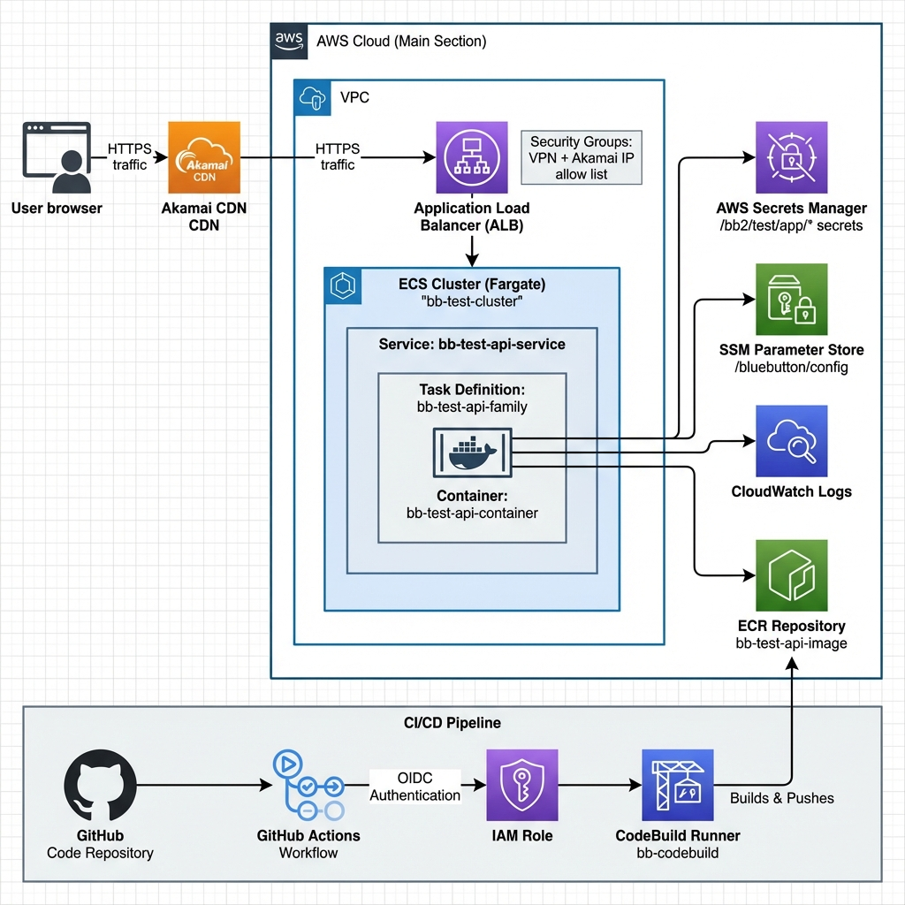
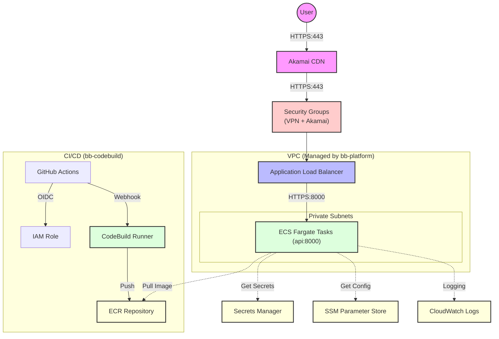
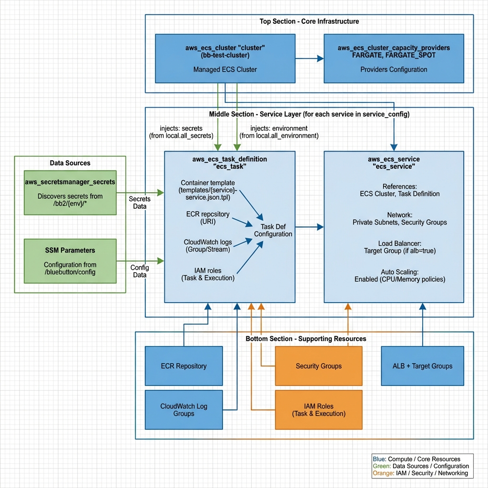

# Architecture Overview: Blue Button API


This document provides a visual and technical overview of the **Terraservice** architecture for the Blue Button API deployment.

## Infrastructure Overview

The following diagram shows the complete infrastructure including external services (Akamai CDN), runtime components (ECS/Fargate), and CI/CD pipeline (GitHub Actions):



### Traffic Flow
- **User Traffic**: User → Akamai CDN → VPN/Akamai Security Groups → ALB → ECS Fargate
- **CI/CD Pipeline**: GitHub → GitHub Actions (OIDC) → CodeBuild → ECR Repository
- **Runtime Dependencies**: ECS Tasks pull images from ECR, secrets from Secrets Manager, config from SSM

---

## Infrastructure Diagram (Detailed Mermaid)



---

## ECS Module Structure

The following diagram shows how the Terraform resources in the `bb-ecs` module are organized and how they depend on each other:



**Key Resource Flow:**
1. **Data Sources** (green): Discover secrets from Secrets Manager and configuration from SSM
2. **Core Infrastructure** (blue): ECS Cluster with Fargate capacity providers
3. **Service Layer** (blue): Task Definitions inject secrets/env vars, Services reference the cluster
4. **Supporting Resources** (orange/blue): IAM roles, Security Groups, ALB, ECR, CloudWatch

---

## Pattern Overview: Terraservice

The infrastructure is built using three primary modules:

### 1. [bb-platform](../modules/bb-platform/platform.tf)
*   **Purpose**: Discovers existing environment resources and loads configuration.
*   **Responsibilities**: VPC/Subnet lookup, ACM Certificate resolution, KMS Key discovery, and SSM Parameter loading.
*   **Output**: A consolidated `platform` object passed to application modules.

### 2. [bb-ecs](../modules/bb-ecs/main.tf)
*   **Purpose**: Provisions the application-specific compute and networking.
*   **Responsibilities**: ECS Cluster, Fargate Service, Target Groups, Security Groups, and IAM Roles.
*   **Security**: ALB restricted to VPN/Akamai security groups; ECS accepts traffic only from ALB on port 8000.

### 3. [bb-codebuild](../modules/bb-codebuild/main.tf)
*   **Purpose**: CI/CD infrastructure for GitHub Actions integration.
*   **Responsibilities**: CodeBuild project (GitHub Actions runner), ECR repository, GitHub OIDC provider, IAM roles.
*   **Integration**: Automatically triggered by GitHub Actions via webhook.

---

## Security Group Flow

```
Internet → Akamai CDN → VPN/Akamai SGs → ALB (443) → ECS SG (8000) → ECS Tasks
```

| Security Group | Purpose |
|----------------|---------|
| `cmscloud-vpn` | CMS VPN access |
| `bb-sg-{env}-clb-cms-vpn` | Environment-specific VPN |
| `bb-sg-{env}-clb-akamai-prod` | Akamai CDN traffic |
| `bb-{env}-api-alb-sg` | ALB ingress (references above SGs) |
| `bb-{env}-ecs-api-sg` | ECS ingress (from ALB only) |

---

## Log & Metric Flow

1.  **Container Logs**: Forwarded via `awslogs` driver to CloudWatch.
2.  **Performance Metrics**: Collected via CloudWatch Container Insights (Cluster level).
3.  **ALB Logs**: Sent to Environment-specific S3 bucket for audit and debugging.
4.  **CodeBuild Logs**: `/aws/codebuild/bb-{env}-web-server` in CloudWatch.

