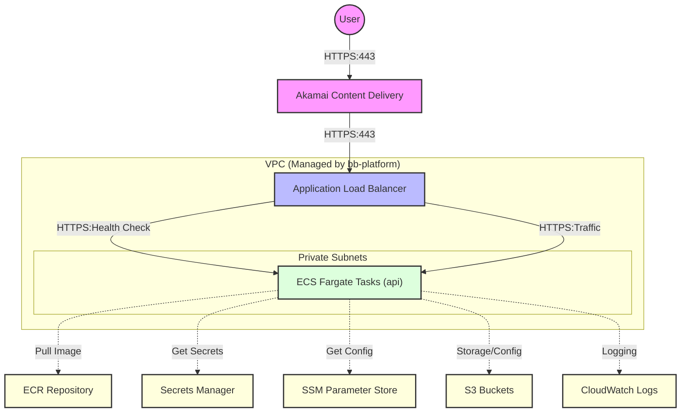

# Architecture Overview: Blue Button API

This document provides a visual and technical overview of the **Terraservice** architecture for the Blue Button API deployment.

## Infrastructure Diagram

---

## Pattern Overview: Terraservice

The infrastructure is built using two primary modules designed to separate foundation from application logic:

### 1. [bb-platform](../modules/bb-platform/platform.tf)
*   **Purpose**: Discovers existing environment resources and loads configuration.
*   **Responsibilities**: VPC/Subnet lookup, ACM Certificate resolution, KMS Key discovery, and SSM Parameter loading.
*   **Output**: A consolidated `platform` object passed to application modules.

### 2. [bb-ecs](../modules/bb-ecs/main.tf)
*   **Purpose**: Provisions the application-specific compute and networking.
*   **Responsibilities**: ECS Cluster, Fargate Service, Target Groups, Security Groups, and IAM Roles.
*   **Security**: Enforces end-to-end **HTTPS-only** (443) for both public and internal traffic.

---

## Log & Metric Flow

1.  **Container Logs**: Forwarded via `awslogs` driver to CloudWatch.
2.  **Performance Metrics**: Collected via CloudWatch Container Insights (Cluster level).
3.  **ALB Logs**: Sent to Environment-specific S3 bucket for audit and debugging.
