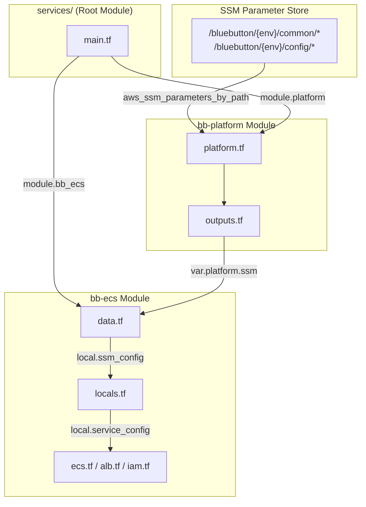

# Terraform SSM Migration: Team Walkthrough

## Executive Summary

We migrated from **tfvars file-based configuration** to **SSM Parameter Store-backed configuration** using the **Terraservice pattern** (inspired by CMS BFD team).

### Why This Change?
| Problem (Before) | Solution (After) |
|------------------|------------------|
| Config in git (tfvars) | Config in SSM Parameter Store |
| Secrets exposed in files | SecureString for sensitive values |
| Manual variable management | Dynamic loading via `aws_ssm_parameters_by_path` |
| Copy-paste across environments | Environment-isolated paths (`/bluebutton/{env}/`) |

---

## Architecture Overview



---

## Module Breakdown

### 1. bb-platform Module (The "Platform" Layer)
**Purpose**: Load SSM parameters, discover VPC/subnets, lookup ACM certificates

| File | Purpose |
|------|---------|
| [platform.tf](../modules/bb-platform/platform.tf) | SSM loading, VPC/subnet discovery, ACM lookup |
| [variables.tf](../modules/bb-platform/variables.tf) | Input: app, env, ssm_hierarchy_roots |
| [outputs.tf](../modules/bb-platform/outputs.tf) | Outputs: ssm, config, vpc_id, subnets, acm_certificate |

**Key Logic** (platform.tf):
```hcl
# 1. Build SSM paths
ssm_hierarchies = ["/bluebutton/${env}/common", "/bluebutton/${env}/config"]

# 2. Load all parameters
data "aws_ssm_parameters_by_path" "params" {
  for_each = toset(local.ssm_hierarchies)
  path     = each.value
  recursive = true
}

# 3. Create map using zipmap
ssm_config = zipmap(
  [for name in names : replace(name, "/${env}/", "/")],
  values
)
```

---

### 2. bb-ecs Module (The "Service" Layer)
**Purpose**: Create ECS cluster, services, ALB, ECR, IAM roles

| File | Purpose |
|------|---------|
| [data.tf](../modules/bb-ecs/data.tf) | References `var.platform.ssm` |
| [locals.tf](../modules/bb-ecs/locals.tf) | Transforms SSM → `service_config` |
| [ecs.tf](../modules/bb-ecs/ecs.tf) | ECS cluster, task definitions, services |
| [alb.tf](../modules/bb-ecs/alb.tf) | Application Load Balancer |
| [iam.tf](../modules/bb-ecs/iam.tf) | Task execution + task roles |
| [ecr.tf](../modules/bb-ecs/ecr.tf) | ECR repositories |
| [security_groups.tf](../modules/bb-ecs/security_groups.tf) | ECS + ALB security groups |

**Key Logic** (locals.tf):
```hcl
service_config = {
  for k, v in var.backend_services : k => {
    port   = tonumber(local.ssm_config["/bluebutton/config/${k}_port"])
    cpu    = tonumber(local.ssm_config["/bluebutton/config/${k}_cpu"])
    memory = tonumber(local.ssm_config["/bluebutton/config/${k}_memory"])
    # ... all config from SSM
  }
}
```

---

## SSM Parameter Structure

```
/bluebutton/
├── test/                          # Environment: test
│   ├── common/
│   │   ├── vpc_id                 # "vpc-XXXXXXXXXX"
│   │   └── azs                    # '["us-east-1a","us-east-1b"]'
│   └── config/
│       ├── api_port               # "8000"
│       ├── api_cpu                # "512"
│       ├── api_memory             # "1024"
│       ├── api_count              # "2"
│       ├── api_min_capacity       # "1"
│       ├── api_max_capacity       # "4"
│       ├── api_health_check_path  # "/health"
│       ├── api_alb                # "true"
│       └── api_autoscale_enabled  # "true"
│
├── sandbox/                       # Environment: sandbox
│   └── ... (same structure)
│
└── prod/                          # Environment: prod
    └── ... (same structure)
```

---

## Data Flow

```
┌─────────────────────────────────────────────────────────────────────────┐
│ 1. SSM Parameter Store                                                  │
│    /bluebutton/test/config/api_cpu = "512"                             │
└───────────────────────────────┬─────────────────────────────────────────┘
                                │
                                ▼
┌─────────────────────────────────────────────────────────────────────────┐
│ 2. bb-platform/platform.tf                                              │
│    aws_ssm_parameters_by_path → zipmap → ssm_config                    │
│    Output: { "/bluebutton/config/api_cpu" = "512" }                    │
└───────────────────────────────┬─────────────────────────────────────────┘
                                │
                                ▼
┌─────────────────────────────────────────────────────────────────────────┐
│ 3. services/main.tf                                                     │
│    module.platform.ssm → var.platform.ssm (passed to bb-ecs)           │
└───────────────────────────────┬─────────────────────────────────────────┘
                                │
                                ▼
┌─────────────────────────────────────────────────────────────────────────┐
│ 4. bb-ecs/locals.tf                                                     │
│    tonumber(local.ssm_config["/bluebutton/config/api_cpu"]) → 512      │
│    Builds: local.service_config = { api = { cpu = 512, ... } }         │
└───────────────────────────────┬─────────────────────────────────────────┘
                                │
                                ▼
┌─────────────────────────────────────────────────────────────────────────┐
│ 5. bb-ecs/ecs.tf                                                        │
│    aws_ecs_task_definition { cpu = each.value.cpu }  → cpu = 512       │
└─────────────────────────────────────────────────────────────────────────┘
```

---

## Deployment Steps

### First Time Setup
```bash
# 1. Create SSM parameters
cd ops/terraform
./scripts/create_ssm_params.sh test

# 2. Initialize
cd services
tofu init
tofu workspace select test

# 3. Deploy
tofu apply
```

### Updating Configuration
```bash
# Change a value in SSM
aws ssm put-parameter --name "/bluebutton/test/config/api_cpu" \
  --value "1024" --type String --overwrite

# Re-apply Terraform (it will pick up new values)
tofu apply
```

---

## Key Files Reference

| File | Path | Purpose |
|------|------|---------|
| Root Module | `services/main.tf` | Entry point, calls platform + ecs modules |
| Backend | `services/backend.tf` | S3 backend with workspace separation |
| Platform | `modules/bb-platform/platform.tf` | SSM loading, VPC discovery |
| ECS Data | `modules/bb-ecs/data.tf` | References platform SSM |
| ECS Locals | `modules/bb-ecs/locals.tf` | Transforms SSM → service_config |
| SSM Script | `scripts/create_ssm_params.sh` | Seeds SSM parameters |

---

## FAQ

**Q: What happens if an SSM parameter is missing?**
A: Terraform will fail with "Invalid index" error. All parameters must exist before `tofu apply`.

**Q: How do I add a new service?**
A: Add SSM parameters for `{service}_port`, `{service}_cpu`, etc., then add to `var.backend_services` map.

**Q: Are secrets safe?**
A: Yes - sensitive outputs are marked `sensitive = true`, and you can use SSM SecureString for secrets.
